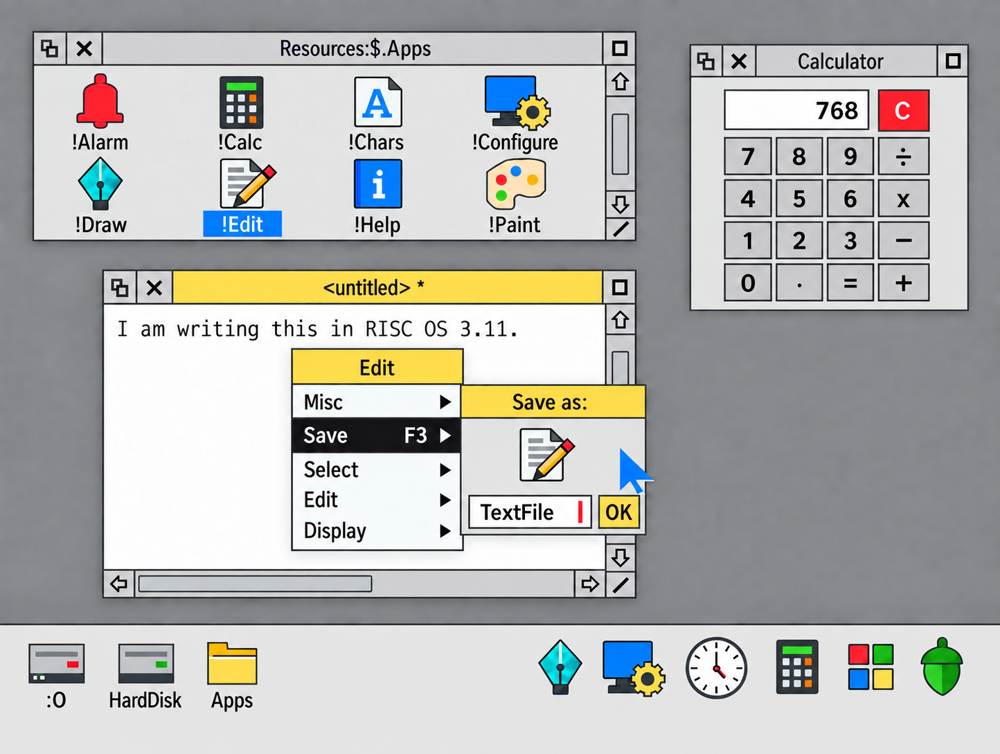

# Approved desktop appearance

Approved by the user on 29 September 2026: “This is it, this is what I want.”

The accompanying `approved-desktop-design.png` is the authoritative visual reference for the desired look. This is an approved design concept, not a record of implemented behaviour. Earlier mockups are superseded by this image.

## Design direction

A modern evolution of RISC OS, inspired by Material design and Flat Remix icon artwork. Preserve the distinctive window furniture, menus, compact proportions and colours while using flat, angular shapes and restrained depth.

## Appearance requirements

- Consistently sized window furniture: title-bar height, square title controls, scrollbar width, horizontal scrollbar height and resize corners share a common dimension. Shared edges align.
- Crisp charcoal borders and control separators. Outline intensity is reduced from the earlier black treatment by approximately 20%; preserve definition and sharpness.
- Clearly outlined directional scrollbar arrows with stems, bordered rectangular thumbs and visibly separated controls.
- Uniform neutral-grey furniture, including title-bar buttons. The approved adjustment is 10% darker than the earlier light-grey furniture, superseding the rejected 20% darkening.
- Pale-grey backgrounds for non-editing surfaces: filer, calculator and Save as dialog. The bottom icon bar uses that same pale grey. These backgrounds are halfway between the neutral title-bar grey and white in the intended palette.
- White document editing surfaces and input fields.
- Yellow active title and menu headers. Selected menu rows use white text and arrows on black. The reference retains blue file-label selection.
- Flat, colourful, geometric application icons with small corner radii and noticeable, consistent dark outlines. Base their silhouettes and details as closely as practical on the [supplied RISC OS 3.11 screenshot](assets/risc-os-3.11-icon-reference.png). Keep them strictly two-dimensional: no perspective, visible thickness, bevels, gradients, glossy highlights, texture, cast shadows, or skeuomorphic rendering. Flat Remix is a secondary influence for colour and polish.
- Subtle blurred shadows behind windows and pop-up menus, with sharp window and control edges.
- Neutral-grey desktop background, without a blue cast.

## Implementation interpretation

The image is a generated mockup, so it is not a pixel-exact colour or geometry specification. The final generation targeted furniture near `#CFCFCF`, non-editing backgrounds and the icon bar near `#E7E7E7`, and softened outlines near `#333333`; these are intended starting values rather than measured colours. Use the approved image and the consistency rules above together when producing implementation assets or design tokens.

## Provenance

Created through iterative edits with the built-in image generation tool. Final source image: `exec-f78a8a0b-2ce0-4ceb-9de1-7ef69a33da83.png`.

Final edit brief: change only the bottom icon-bar background to the same pale neutral grey as the filer and Save as backgrounds, preserving the established design.
